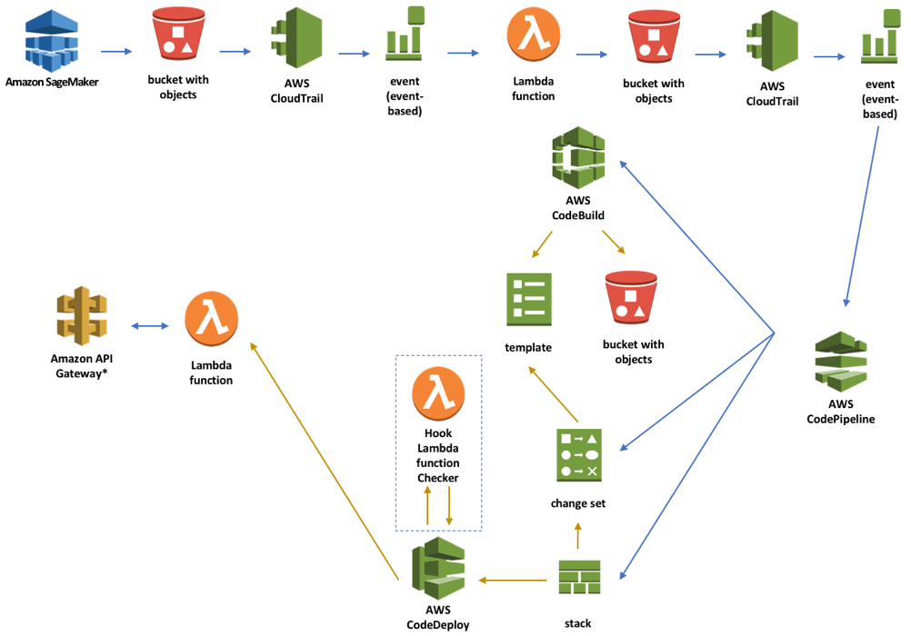
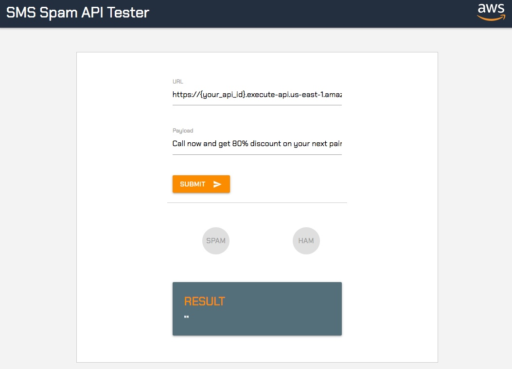

# Automating Deployment

Obviosly once we tested the solution and the Lambda function with the model, we want to make sure to have set up a deployment pipeline that would allow our AI specialists to deploy the new trained model in continuous delivery.

In order to create the pipeline for CI/CD, we can use the AWS Developer Tools. The suite uses AWS CodeDeploy, AWS CodeBuild, AWS CodePipeline. Here the diagram of the architecture: 



When we train the model with Amazon SageMaker, the output model is saved into an Amazon S3 bucket. Each time a file is put into the bucket, AWS CloudTrail will trigger an AWS CloudWatch event that will invoke an AWS Lambda function to check whether the file uploaded is a new model file and move this to a different Amazon S3 bucket. This is necessary because, Amazon SageMaker saves the model file but also other files like the checkpoints in different folders but AWS CodePipeline is listening for a specific file in a specific folder of an Amazon S3 bucket to be triggered. Therefore, once the model file is moved from Amazon SageMaker’s bucket to the destination bucket, AWS CodePipeline is triggered.

To begin, AWS CodePipeline invokes AWS CodeBuild to create the deployment package of the AWS Lambda function and the AWS SAM template to create the AWS API Gateway and the AWS Lambda function to serve the inference. Once this is done, AWS CodePipeline executes the change set to transform the AWS SAM template into an AWS Cloudformation template and executes it. Once the AWS Cloudformation is executed, this will trigger AWS CodeDeploy. AWS CodeDeploy invokes a Lambda function to test whether the newly created AWS Lambda function with the latest version of our model is working as expected and if so, AWS CodeDeploy will start shifting the traffic from the old version to the new version of the AWS Lambda function and the deployment is done. 

# Let's get started:

First of all, we need to upload two key files into our S3 bucket **_smlambda-workshop-[your-initials]_**. 

1. Download these three files from our repository:

```
# This is an empty.zip file that is necessary for AWS CodePipeline to use S3 as a source repository. For the way we approached the creation of our Lambda function, this is an empty file zip.  
wget https://github.com/giuseppeporcelli/smlambdaworkshop/blob/master/automating/empty.zip

# This is the CloudFormation template that will create all the pipeline
wget https://raw.githubusercontent.com/giuseppeporcelli/smlambdaworkshop/master/automating/pipeline.yaml

# This is the Lambda function that will move the model from a bucket to another
wget https://github.com/giuseppeporcelli/smlambdaworkshop/blob/master/automating/lambdaCopyModel.zip

```

2. Go to Amazon S3 Console.
3. Open your S3 bucket
4. Click **Upload** button
5. Click **Add files**
6. Select the two files **empty.zip** and **lambdaCopyModel.zip**
7. Press **Next**, **Next**, **Next** and **Upload**

Now, it is time to create the pipeline. In order to do this, we are going to use AWS CloudFormation:

1. Go to AWS CloudFormation Console
2. Select **Create Stack**
3. Click on **Browser** and select your CloudFormation template file that you downloaded before
4. Press **Next**
5. In **Stack Name** use something like **smlambda-workshop-stack**
6. Change **SourceS3Bucket** with your MXNet bucket name **smlambda-workshop-{INITIALS}**
7. Press **Next**
8. Press **Next**
9. Select **I acknowledge that AWS CloudFormation might create IAM resources.**
10. Click **Create**

This would take a few minutes to create. Once the process is completed, we will see that the status of the stack is **CREATE COMPLETE**.

# Test the environmet

Now, we can go back to our SageMaker developer instance and launch the training again. This would create a new model that would automatically trigger the creation of our Lambda function and Amazon API Gateway endpoint that would serve our model.

1. Go to Amazon SageMaker console.
2. Click on **Notebook instances** and **open** your Notebook instance.
3. Browse to the folder **smlambdaworkshop > training** and open the file **sms\_spam\_classifier\_mxnet.ipynb**
4. Go to step 7 and run it again.

Once the model is trained succesful, the model.tar.gz will be uploaded into the S3 bucket and the pipeline will be triggered.

# Verify the execution

In order to monitor the pipeline, we will use AWS CodePipeline console:

1. Open **AWS CodePipeline** console
2. Select your pipeline
3. In the console you will see the status of the steps
4. Once finished, let's go to Amazon API Gateway console to get the URL of the API
5. Open **Amazon API Gateway console**
6. Select the API
7. Click on **Stages**
8. Select **Prod**
9. Copy the Invoke URL. It should have a format similar to **https://{some-random-keys}.execute-api.us-east-1.amazonaws.com/Prod**

Go to the URL [https://apitester.diegos.it/](https://apitester.diegos.it/) and add your Amazon API Gateway endpoint and press **SUBMIT**. It would be easy to see the result and the prediction. 



