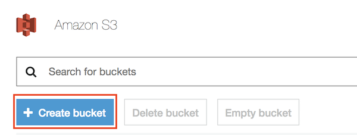
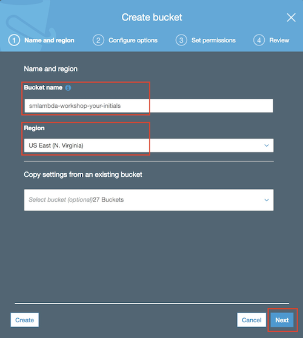
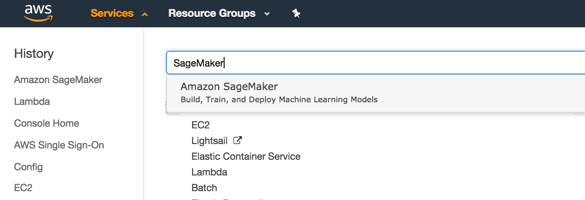
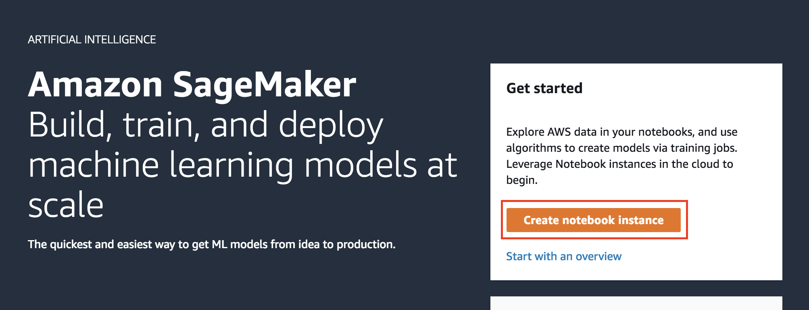
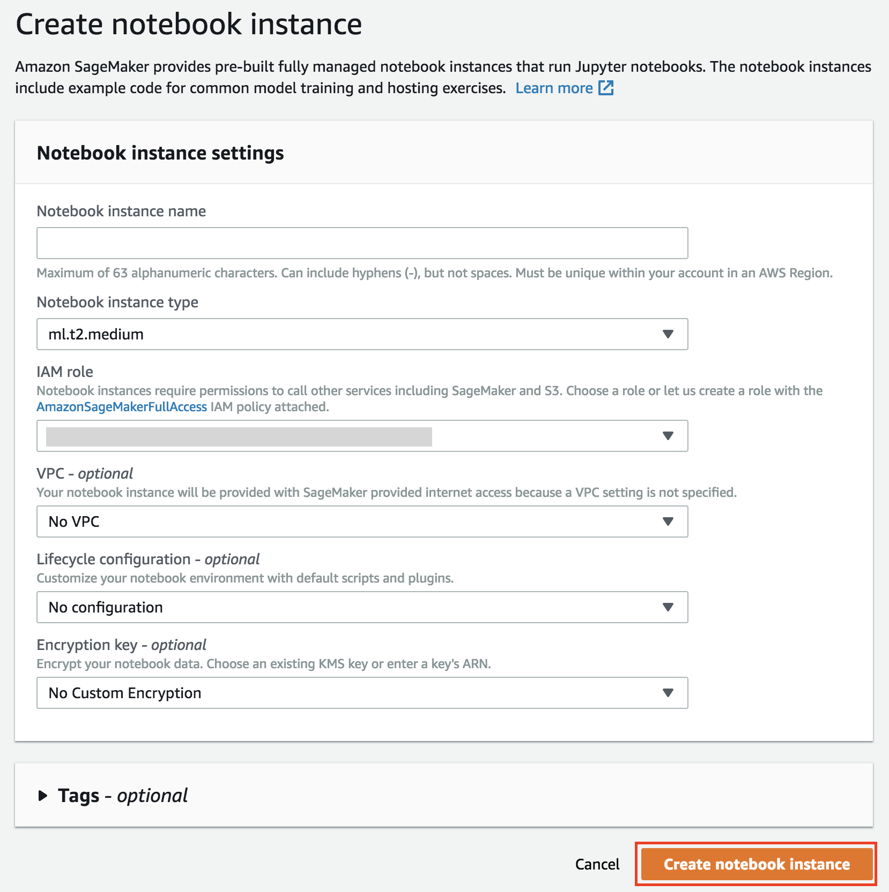
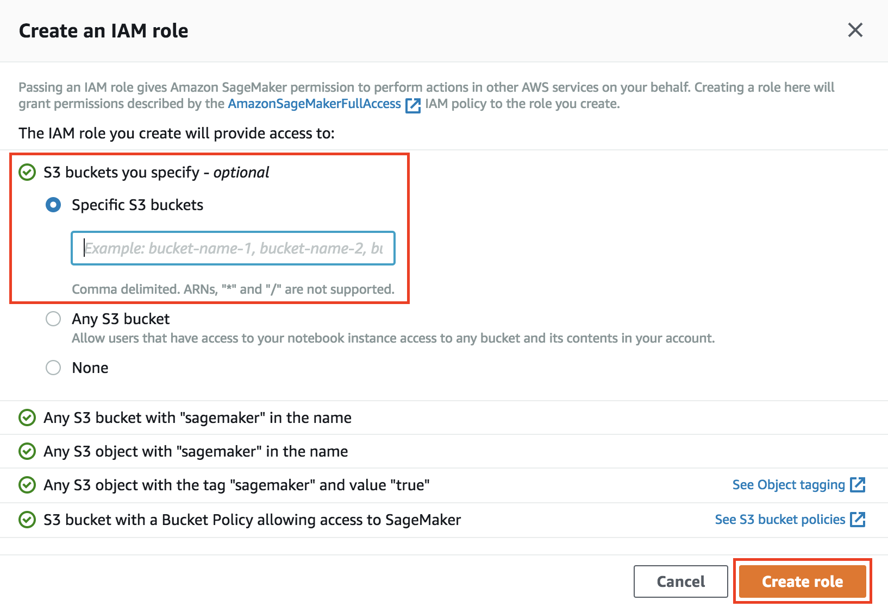
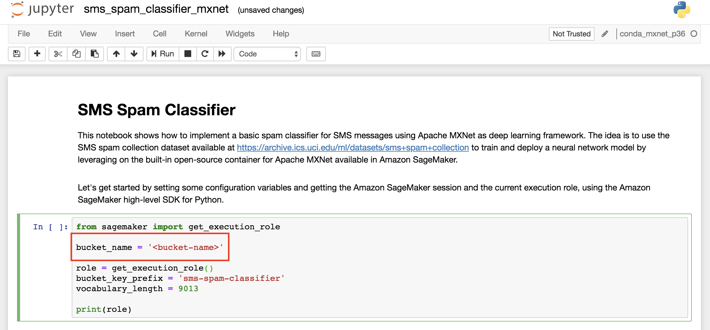
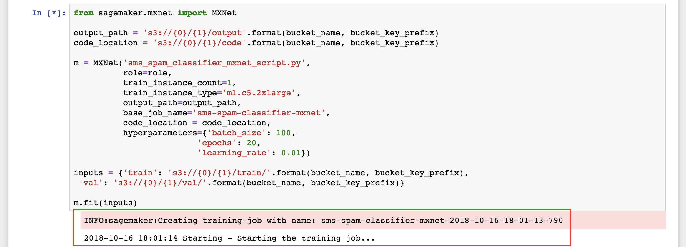
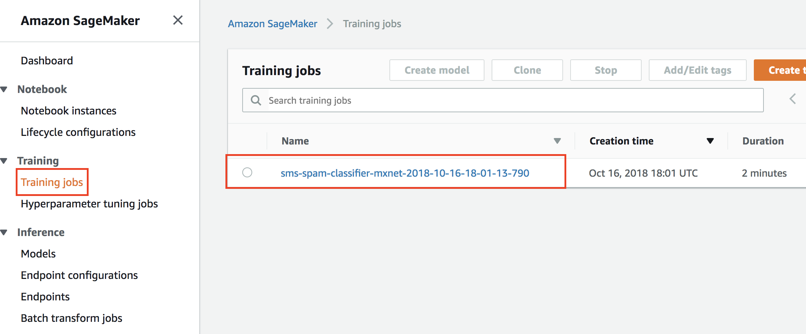

# Training the Spam Filter model with Amazon SageMaker

## Overview

Amazon SageMaker is a fully-managed service that enables developers and data scientists to quickly and easily build, train, and deploy machine learning models at any scale. Amazon SageMaker removes all the barriers that typically slow down developers who want to use machine learning.

Machine learning often feels a lot harder than it should be to most developers because the process to build and train models, and then deploy them into production is too complicated and too slow. First, you need to collect and prepare your training data to discover which elements of your data set are important. Then, you need to select which algorithm and framework you’ll use. After deciding on your approach, you need to teach the model how to make predictions by training, which requires a lot of compute. Then, you need to tune the model so it delivers the best possible predictions, which is often a tedious and manual effort. After you’ve developed a fully trained model, you need to integrate the model with your application and deploy this application on infrastructure that will scale. All of this takes a lot of specialized expertise, access to large amounts of compute and storage, and a lot of time to experiment and optimize every part of the process. In the end, it's not a surprise that the whole thing feels out of reach for most developers.

Amazon SageMaker removes the complexity that holds back developer success with each of these steps. Amazon SageMaker includes modules that can be used together or independently to build, train, and deploy your machine learning models.

In this section, we will walk you through creating and training a spam filter machine learning model with Amazon SageMaker.

## The Dataset
In order to train the model, we will use the <a href="https://archive.ics.uci.edu/ml/datasets/sms+spam+collection">**UCI SMS Spam Collection**</a> dataset.
It contains a public set of SMS labeled messages that have been collected for mobile phone spam research.

|Number of examples  | 5574                      |
|--------------------|---------------------------|
|Ham                 | 4827                      |
|Spam                | 747                       |

If you want to know more about the origin of the words spam & ham please visit: <a href="https://en.wiktionary.org/wiki/ham_e-mail">https://en.wiktionary.org/wiki/ham_e-mail</a>

The collection is composed by just one text file, where each line has the correct class followed by the raw message. Some examples are bellow: 

|Class |SMS Text|
|------|----------------------------|
|ham	|What you doing?how are you?|
|ham	|Ok lar... Joking wif u oni...|
|ham	|dun say so early hor... U c already then say...|
|ham	|MY NO. IN LUTON 0125698789 RING ME IF UR AROUND! H*|
|ham	|Siva is in hostel aha:-.|
|ham	|Cos i was out shopping wif darren jus now n i called him 2 ask wat present he wan lor. Then he started guessing who i was wif n he finally guessed darren lor.|
|spam	|FreeMsg: Txt: CALL to No: 86888 & claim your reward of 3 hours talk time to use from your phone now! ubscribe6GBP/ mnth inc 3hrs 16 stop?txtStop| 
|spam	|Sunshine Quiz! Win a super Sony DVD recorder if you canname the capital of Australia? Text MQUIZ to 82277. B|
|spam	|URGENT! Your Mobile No 07808726822 was awarded a L2,000 Bonus Caller Prize on 02/09/03! This is our 2nd attempt to contact YOU! Call 0871-872-9758 BOX95QU|

## The Task

We are going to build and train a binary classification model that will be able to predict whether a SMS message contains spam or not.

## Building and Training the model

### Create an Amazon S3 bucket
In this section, we will create an Amazon S3 bucket as staging area. Amazon SageMaker uses **Amazon S3** as the main storage for both data and model artifacts; you can actually use other sources when loading data into the Jupyter notebook instances, but this is outside of the scope of this lab.

1. Sign into the **AWS Management Console** at <a href="https://console.aws.amazon.com/">https://console.aws.amazon.com/</a>
2. In the upper-right corner of the AWS Management Console, confirm you are in the desired AWS region. For this workshop we will use the **US East (N. Virginia)** [us-east-1]
3. Open the **Amazon S3** console at <a href="https://console.aws.amazon.com/s3">https://console.aws.amazon.com/s3</a> or choose the Amazon S3 service in the menu.
4.	In the Amazon S3 console, click the **Create Bucket** button.
	
5.	For the **Bucket Name**, type _smlambda-workshop-**[your-initials]**_ in the text box and click Next (take note of the bucket name, it will be needed later for loading data in the notebook instance). Leave everything default in the next 2 pages and click **Create Bucket** in the Review page.
Note: if the bucket name is already taken, feel free to add an extra suffix.

	

### Create a managed Jupyter Notebook instance
In this section we will use an Amazon SageMaker managed Jupyter notebook instance to prepare and process data and write the code to train the model.
An **Amazon SageMaker notebook instance** is a fully managed ML compute instance running the <a href="http://jupyter.org/">**Jupyter Notebook**</a> application. Amazon SageMaker manages creating the instance and related resources. 

1. In the AWS Management Console, click on Services, type “SageMaker” and press enter.
	
	
2. You’ll be placed in the Amazon SageMaker dashboard. Click on **Create notebook instance**.
	
	
3. In the **Create notebook instance** screen

	

	1. Give the Notebook Instance a name like _notebook-instance-**[your-initials]**_

	2. Choose **ml.t2.medium** as **Notebook instance type**
	3. Choose **Create a new role** in the **IAM role** dropdown list. Notebook instances require permissions to call other services including Amazon SageMaker and Amazon S3 APIs. Choose **Specific S3 buckets** in the **Create an IAM role** window and input the name of the bucket that you have created in the previous section. Then click on **Create role**.
	
		
		If you already had a role with the proper grants to access the newly created bucket, creating a new role is not mandatory and you can just choose to use the existing role.
	4. Keep **No VPC** selected in the **VPC** dropdown list
	5. Keep **No configuration** selected in the **Lifecycle configuration** dropdown list
	6. Keep **No Custom Encryption** selected in the **Encryption key** dropdown list
	7. Finally, click on **Create notebook instance**

4. You will be redirected to the **Notebook instances** screen
	
	Wait until the notebook instance is status is **In Service** and then click on the **Open** button to be redirected to Jupyter
	
	
	
	

### Download notebook and training code to the notebook instance

For the purpose of this workshop the code required to build and train the Machine Learning model is pre-implemented and available for download from GitHub.

As a consequence, in this section we will clone the GitHub repository into the Amazon SageMaker notebook instance and access the Jupyter notebook to run training.

1. Click on **New > Terminal** in the right-hand side of the Jupyter interface
	
	

	This will open a terminal window in the Jupyter interface
	
	

2. Execute the following commands in the terminal

	```bash
	cd SageMaker
	git clone https://github.com/giuseppeporcelli/smlambdaworkshop
	```
3. When the clone operation completes, close the terminal window and return to the Jupyter landing page. The folder **smlambdaworkshop** will appear automatically (if not, you can hit the **Refresh** button)

	
	
4. Browse to the folder **smlambdaworkshop > training** and open the file **sms\_spam\_classifier\_mxnet.ipynb**

### Execute notebook code and run training

We are ready to execute the steps for building and training our Machine Learning model!

1. Once the notebook file is opened, you will be asked to set a _kernel_. Choose **conda\_mxnet\_p36** and click on **Set Kernel**. Kernels in Jupyter are responsible of code execution, providing replyies, etc. and generally allow the execution of a single programming language.

	

2. We will use the Jupyter Notebook as the interface for buiding our model and call Amazon SageMaker for training. Jupyter allows code execution by selecting the code cell and pressing on the **Run** button in the toolbar (alternatively, you can use the **SHIFT + Enter** keyboard shortcut.
	
	

3. Next steps are documented in the Jupyter notebook itself. From an high-level perspective, the notebook code will:
	- Download the dataset to the notebook instance
	- Execute some pre-processing to vectorize SMS messages
	- Split the dataset 80%/20% (training/validation)
	- Build a neural-network using Gluon, a deep-learning interface for Apache MXNet
	- Execute training on Amazon SageMaker

	The notebook code **does not need to be modified**, except for the name of the Amazon S3 bucket that you have created and used in the previous sections.
	
	
	
4. Execute **all the cells in sequence** (note that while the code in a cell is running the interface shows **[\*]** to the upper-left of the cell) up to the execution of the training, which will start a **Training Job** in Amazon SageMaker.

	

	You will see several outputs in the notebook, showing the progress of the training process.
	
5. You can also monitor the status of the training job from the Amazon SageMaker console
	
	
	
6. When the training job completes successfully, you can move to the next section!

	_Please note that the notebook code includes also other steps which allow to automatically deploy the trained ML model to the managed hosting service provided by Amazon SageMaker, which will create a real-time endpoint that can be invoked to get inferences. Those steps are not mandatory for this workshop and are implemented for educational purposes._